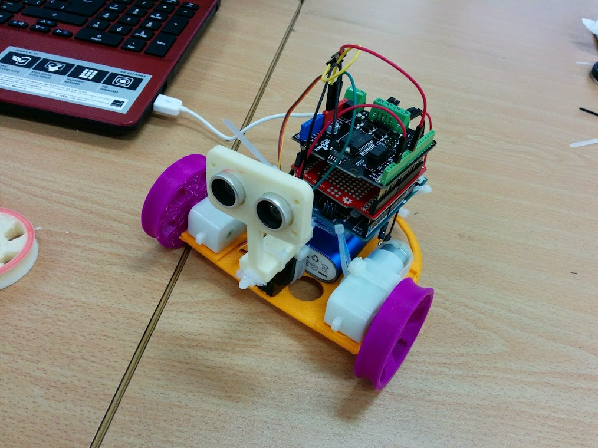
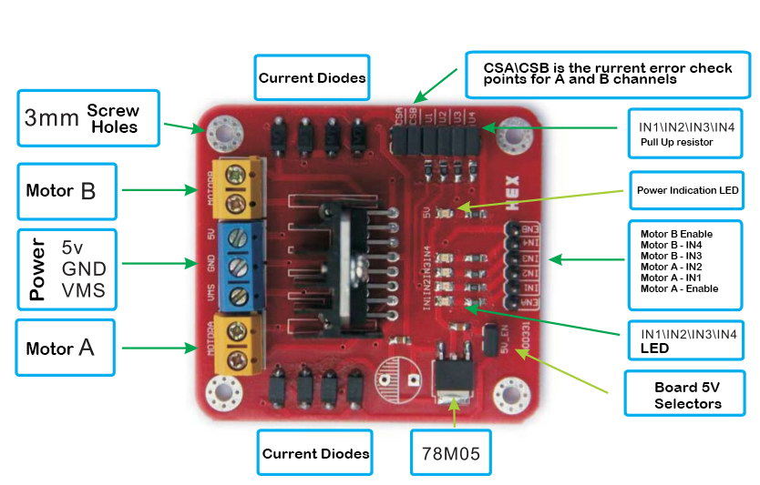
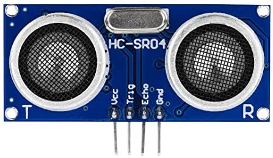
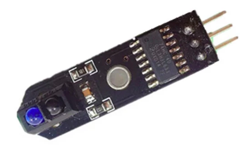

# Sencillo robot móvil

Utilizamos: 

* Controlador de motores L298 

* Sensor de ultrasonidos

* Sensor de suelo

Conexiones de los pines

Funcionalidad|pin|Nombre
---|---|---
motor1_velocidad|11|EnA
motor1_adelante|7|In1
motor1_atras|8|In2
motor2_adelante|12|In3
motor2_atras|10|In4
motor2_velocidad|9|  EnB
sensor US Trigger|4| Trigger
sensor US Echo|5|Echo
sensor IR Suelo|6|